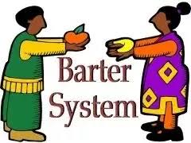

# AMANA
## A Web3 Marketplace for Feelancers
Post your skills, find a gig, get paid in crypto!

## Table of content

- Background

- Overview of the product

- Technology

- Code Files

## Background
### Breaking the barriers.

With the advent of technology the world has changed to a global village. AMANA's goal is to connect talents and recruiters wherever they are in the world while leveraging the power of blockchain!
With our platform people can make use of each others ability with the exchange of a currency that knows no boundries "Cryptocurrency", and for this purpose we would make use of stable coin to equip users to over come the harsh boudries of inter-country regulations surrounding fiat transfer.

We aim to proceed with the basic features of blockchain, i.e : 
    1. Anonimity.
    2. Trust.
    3. Transparency.
    4. De-Centralization.
    
Having presented with the basic idea behind our product, here is a 3 step transformation of exchange between humans:
    1. Exchange of goods with goods of equal value.
    
    2. The take over of fiat.
    
    3. Taking a leap forward with digitalization.
    
    
